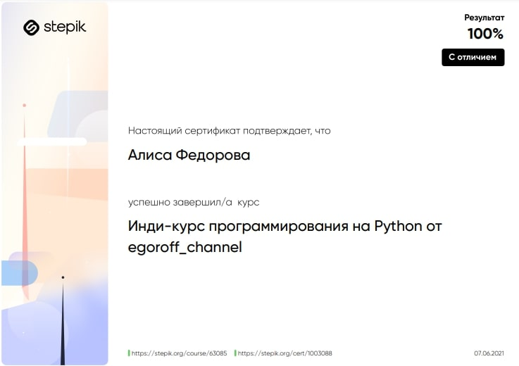
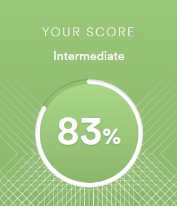

# Alisa Fedorova

**Junior Frontend Developer**

**Contact information:**

**Phone:** +7 911 292 48 06

**E-mail:** alisa.fed.91@gmail.com

**Telegram:** @alisa_fed

---

## **Briefly about myself:**
I started my career as a trainee in Python programming courses conducted by Stepik. After finishing the courses with a grade of 100% I decided to continue my journey in programming by studying Git, GitHub and Jenkins. 

When I started learning JavaScript my knowledge of Git and Jenkins was very helpful with my pet project. I was really excited about JavaScript and was spending all my spare time learning, reading books and writing code.

Finished JavaScript/Front-end 2022Q1 course at RSschool. Have experience working in a team on the final project of the course.  

I am very keen on web development and doing my best to become a seasoned JavaScript developer.

---

## **Skills and Proficiency:**
* Programming languages:
  + JavaScript
  + Python Basics
  + TypeScript
* Webpack
* Git, GitHub
* HTML
* CSS

---

#### **Code example:**
The makeLooper() function (make_looper in Python) takes a string (of non-zero length) as an argument. It returns a function. The function it returns will return successive characters of the string on successive invocations. It will start back at the beginning of the string once it reaches the end:
``` JavaScript
function makeLooper(str) {
  let elem = 0;
  return function() {
    let answer = str[elem%str.length];
    elem++;
    return answer;
  }
}
```

---

### **Courses:**
* JavaScript Manual on [learn.javascript.ru](https://learn.javascript.ru/) (in progress)
* RS Schools Cource “JavaScript/Front-end. Stage 1”
* RS Schools Cource “JavaScript/Front-end. Stage 2” 
* Python programming course on [Stepik](https://stepik.org/) 

 

---

### **Languages:**
* Russian - Native
* English - B2 (according to the online test at [www.efset.org](https://www.efset.org/))

 