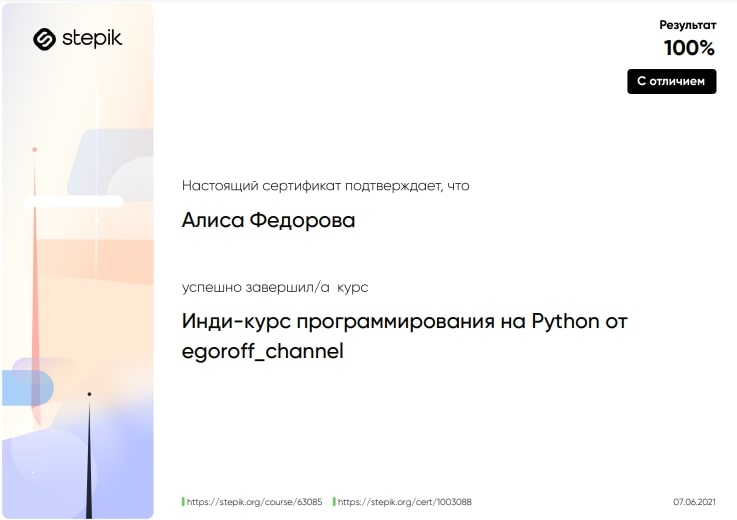
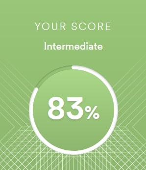

# Alisa Fedorova
***
**Junior Frontend Developer**

**Contact information:**

**Phone:** +7 911 292 48 06

**E-mail:** alisa.fed.91@gmail.com

**Telegram:** @alisa_fed
***
## **Briefly about myself:**
I started my career as a trainee in Python programming courses conducted by Stepik. After finishing the courses with a grade of 100% I decided to continue my journey in programming by studying Git, GitHub and Jenkins. 

When I started learning JavaScript my knowledge of Git and Jenkins was very helpful with my pet project. I was really excited about JavaScript and was spending all my spare time learning, reading books and writing code.

It was so amazing how friendly JavaScript community is, how many great resources it provides for newcomers like: books, articles, video lessons and tutorials.  

I am very keen on web development and doing my best to become a seasoned JavaScript developer.

***
## **Skills and Proficiency:**
* Programming languages:
  * JavaScript Basics
  * Python Basics
* Pycharm
* Git, GitHub
* Jenkins
***
#### **Code example:**
Write a modify_list(l) function that takes a list of integers as input, removes all odd values from it, and divides the even ones completely by two. The function should not return anything, it only needs to change the passed list. The function should not perform input/output of information:
``` Python
def modify_list (l):
    le = len(l) - 1
    i = le
    while i! =- 1:
        if l[i]%2:
            del l[i]
        else:
            l[i]=l[i]//2
        i -=1
```

***
### **Courses:**
* JavaScript Manual on [learn.javascript.ru](https://learn.javascript.ru/) (in progress)
* RS Schools Cource “JavaScript/Front-end. Stage 1” (in progress)
* Python programming course on [Stepik](https://stepik.org/) 

 

***
### **Languages:**
* English – Intermediate (according to the online test at [www.efset.org](https://www.efset.org/)
 
* Russian -Native